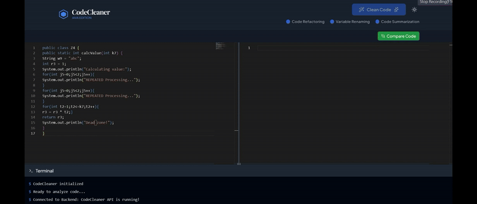

# CodeCleaner
CodeCleaner is an innovative tool designed to streamline code quality improvement by automating comprehensive documentation, enhancing readability through intelligent variable renaming, and enforcing consistent coding practices across large-scale projects



## Requirments
- Python 3 (>= v3.12)
- Fastapi (>= v0.115)
- Nltk (>= v3.9)
- Tqdm (>= v4.66)
- pydantic (>= v2.11)
- ollama (optional; >= v0.4)
- openai (>= v1.70)
- sacrebleu (optional; >=v2.5)

## Install Dependencies

### Installing backend

Change to the backend directory and type the following command:

```
pip install -r requirements.txt
```

### Installing frontend

Change to the frontend directory and type the following command:

```
npm install
```

### Installing Other Dependencies
   - `summaryT5` (run ``` python model.py  ``` [Then train the model])
   - `Ollama` (Optinal for Deepseek)
     Use link : https://ollama.com/download
     then run  ``` ollama pull deepseek-coder:6.7b
  ``` (Ensure you have sufficient disk space, as the model requires approximately 3.8GB of storage.)
